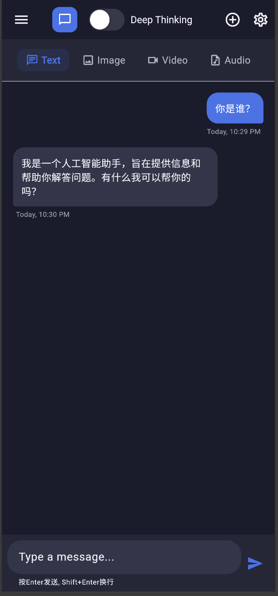

# AI Assistant

A Flutter cross-platform application for AI-powered content generation, featuring conversation, image, video, and music generation capabilities.


## Features

- Dialog-based main interface
- Deep Thinking mode option
- Customizable AI model configuration
- Support for various content generation types:
  - Text conversations
  - Image generation
  - Video generation
  - Music generation
- WeChat login integration
- Local and cloud storage options

## Getting Started

### Prerequisites

1. Install Flutter SDK
   ```
   # macOS with Homebrew
   brew install flutter

   # Or download from https://flutter.dev/docs/get-started/install
   ```

2. Set up Flutter environment
   ```
   flutter doctor
   ```

3. Configure WeChat Developer account and obtain API keys

### Installation

1. Clone the repository
   ```
   git clone https://github.com/yourusername/ai-assistant.git
   cd ai-assistant
   ```

2. Install dependencies
   ```
   flutter pub get
   ```

3. Run the application
   ```
   flutter run
   ```

## Project Structure

```
lib/
  ├── main.dart              # Application entry point
  ├── app.dart               # App configuration
  ├── models/                # Data models
  ├── screens/               # UI screens
  ├── widgets/               # Reusable UI components
  ├── services/              # Backend services
  │   ├── ai_service.dart    # AI provider integration
  │   ├── auth_service.dart  # Authentication service
  │   └── storage_service.dart # Data storage service
  ├── config/                # Configuration files
  └── utils/                 # Utility functions
```

## Configuration

API keys and configuration should be stored in `lib/config/app_config.dart` file (not included in version control).

## License

This project is licensed under the MIT License - see the LICENSE file for details.